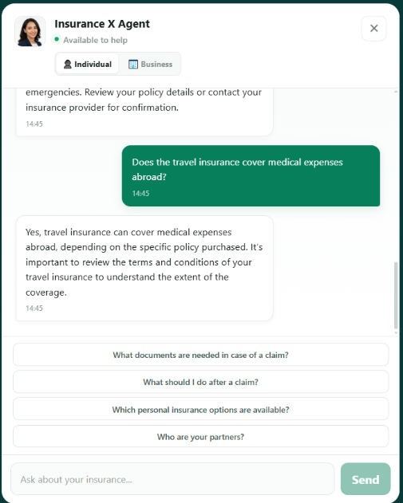

# Insurance AI Agent



An AI-powered insurance assistant that analyzes customer messages, identifies their insurance needs, and connects qualified prospects with the appropriate company team.

## Tech Stack

### Frontend

* Angular 18.2
* TypeScript 5.5
* RxJS 7.8
* Angular Router
* Angular HttpClient
* SweetAlert2
* CSS

### Backend

* Java 17
* Spring Boot 3.4.4
* Spring Web
* Spring Data JPA
* Spring Security
* PostgreSQL
* OpenRouter AI
* Spring Mail
* JWT
* MapStruct
* Lombok
* Apache POI

---

## System Requirements

Make sure your PC has:

* **Node.js:** LTS version
* **npm:** included with Node.js
* **Java:** 17 or higher
* **Maven:** 3.9+
* **PostgreSQL:** 14+
* Internet connection for AI and email services

---

# Frontend — Angular

The frontend provides the web interface for the Insurance AI Agent.

## Installation

```bash
cd Fronend_Angular
npm install
```

## Run

```bash
npm start
```

Application:

```text
http://localhost:4200
```

## Production Build

```bash
npm run build
```

Output:

```text
dist/project
```

## Tests

```bash
npm test
```

---

# Backend — Spring Boot

The backend provides the REST API, AI integration, prospect handling, email notifications, and PostgreSQL persistence.

## Requirements

* Java 17
* Maven 3.9+
* PostgreSQL 14+
* Gmail account with an App Password
* OpenRouter API key

## Database

Create the PostgreSQL database:

```sql
CREATE DATABASE chatBot;
```

Default configuration:

```text
Host: localhost
Port: 5432
Database: chatBot
Username: postgres
```

## Configuration

Edit:

```text
Backend_Springboot/src/main/resources/application.properties
```

```properties
spring.datasource.url=jdbc:postgresql://localhost:5432/chatBot
spring.datasource.username=postgres
spring.datasource.password=YOUR_DATABASE_PASSWORD

spring.mail.username=YOUR_GMAIL@gmail.com
spring.mail.password=YOUR_GMAIL_APP_PASSWORD

internal.api.key=ProjectChatBot

openrouter.api.key=YOUR_OPENROUTER_API_KEY
```

> **Security:** Never commit real passwords, API keys, or Gmail App Passwords to GitHub.

## Run Backend

From the backend directory:

```bash
cd Backend_Springboot
mvn spring-boot:run
```

Backend:

```text
http://localhost:8080
```

## Build Backend

```bash
mvn clean package
```

---

# Project Structure

```text
Insurance-AI-Agent/
│
├── Backend_Springboot/
│   ├── src/
│   ├── pom.xml
│   └── application.properties
│
├── Fronend_Angular/
│   ├── src/
│   ├── public/
│   ├── package.json
│   └── angular.json
│
└── README.md
```

---

# Running the Project

### 1. Start PostgreSQL

Make sure PostgreSQL is running and the `chatBot` database exists.

### 2. Start the Backend

```bash
cd Backend_Springboot
mvn spring-boot:run
```

### 3. Start the Frontend

Open another terminal:

```bash
cd Fronend_Angular
npm install
npm start
```

Open:

```text
http://localhost:4200
```

---

## Author

**Nizar Tarik**

Full-Stack Developer — Angular & Spring Boot
